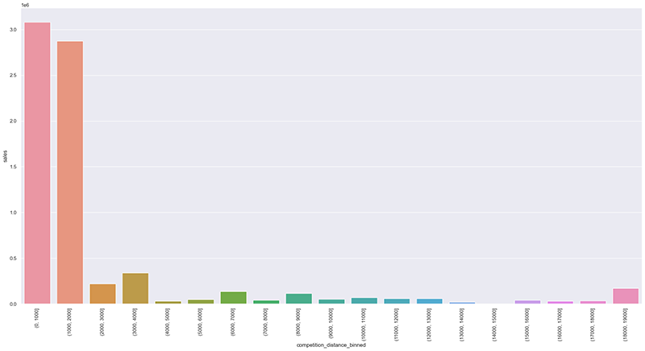
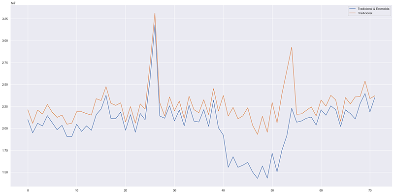
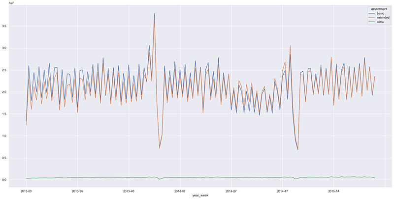

## Rossmann Sales Predictions

### Previsão de vendas da Rede de Drogarias Rossmann

*A base de dados foi coletada do Kaggle. Ainda que a empresa e a base de dados seja real, o problema de negócio é fictício.*  
 [Clique aqui para ter acesso à base de dados original do Kaggle](https://www.kaggle.com/c/rossmann-store-sales/overview/description) 

------------------
### Problema de Negócio

  Rossmann é uma rede de drogarias que opera mais de 3000 lojas em 7 países europeus. O CFO da Rossmann exigiu dos gerentes uma previsão de vendas de cada loja nas próximas seis semanas, pois precisa garantir que terá orçamento suficiente para reformá-las.
  
  O projeto tem como objetivo principal:
  
   * Desenvolver uma previsão de vendas de cada loja para as próximas 6 semanas. 
   * Implantar o modelo de previsões em um Bot na rede social Telegram. 
 
--------------------------
### Presunções de Negócio

#### Visão Geral dos Dados 

  
Clique aqui para ver a descrição das colunas.

  
|Atributo 	                        |Definição |
| :---                            |     :---          |
|Id 	                            | Um Id que representa uma dupla (Store, Date) nos dados de teste |
|Store 	                          | Um único Id para cada loja|
|Sales 	                          | Quantidade de dinheiro arrecadado no dia do registro|
|DayOfWeek 	                      | dia da semana que as vendas foram feitas (ex: DayOfWeek=1 -> segunda-feira, DayOfWeek=2 -> terça, etc).|
|Date                             |	data em que as vendas foram feitas |
|Customers                        |	o número de clientes no dia do registro|
|Open                             |	um indicador se a loja estava aberta no dia do registro: 0 = fechada, 1 = aberta.|
|StateHoliday                     |	indica um feriado estadual. Normalmente todas as lojas, com poucas exceções, fecham nos feriados estaduais. Observe que todas as escolas fecham nos feriados e fins de semana. a = feriado, b = feriado da Páscoa, c = Natal, 0 = nenhum.|
|SchoolHoliday                    |	indica se a loja foi afetado pelo fechamento de escolas públicas.|
|StoreType                        |	diferencia quatro modelos de lojas diferentes: a, b, c, d.|
|Assortment                       |	descreve um nível de classificação das lojas a = basic, b = extra, c = extended.|
|CompetitionDistance              |	distância em metrôs da loja competidora mais próxima.|
|CompetitionOpenSince(Month/Year) |	informa o ano e o mês aproximados do momento em que o concorrente mais próximo foi aberto.|
|Promo 	                          | indica se uma loja está realizando uma promoção naquele dia.|
|Promo2 	                        |Promo2 é uma promoção contínua e consecutiva para algumas lojas: 0 = a loja não está participando, 1 = a loja está participando.|
|Promo2Since(Year/Week)           |	descreve o ano e a semana em que a loja começou a participar do Promo2.|
|PromoInterval                    |	descreve os intervalos consecutivos em que o Promo2 é iniciado, nomeando os meses em que a promoção é iniciada novamente. Por exemplo. "Feb,May,Aug,Nov" significa que cada rodada começa em fevereiro, maio, agosto e novembro de qualquer ano para essa loja.|
  

#### Presunções

Para valores NaN na coluna "competition_distance" foi assumido que não há nenhum concorrente próximo e, em seguida, foi substituído por um valor maior que o valor máximo de "competition_distance". 

A coluna "cliente", que representa o número de clientes, foi descartada ao treinar o modelo, pois não há informações sobre esse número futuramente. 

  
Clique para ver os novos atributos criados

  
  |New Feature 	                                                                                         | Definition                                     | 
  | :---                                                                                                 |     :---                                       |
  |year/month/day/week_of_year/year_week                                                                 | períodos de tempo extraídos da coluna "date"                 |
  |day_sin/day_cos/month_sin/month_cos/week_of_year_sin/week_of_year_cos/day_of_week_sin/day_of_week_cos | atributos derivadas em sin/cos para representar sua característica cíclica                      |
  |competition_since                                                                                     | data de início de competição         |
  |competiton_time_month                                                                                 | período em meses que a competição começou |
  |promo_since                                                                                           | concatenação das colunas 'promo2_since_year' e 'promo2_since_week', formando uma data só.  
  |promo_time_week                                                                                       | tempo em semanas a partir do momento em que a promoção estava ativa.                                |
  |state_holiday(christmas/easter_holiday/public_holiday/regular_day)                                    | indica se a venda foi feita no natal, páscoa, feriado ou dia normal. |
  |is_promo2                                                                                             | se a compra ocorreu durante uma promo2 (1) ou não (0)                  |

--------------------------
### Estratégia de Solução

**Etapa 01. Descrição dos dados.** O objetivo é usar métricas estatísticas para identificar dados fora do escopo do negócio

**Etapa 02. Feature Engineering** Derivar novos atributos com base nas variáveis originais para melhor descrever o fenômeno que será modelado

**Passo 03. Filtragem de Dados.** Filtrar linhas e selecionar colunas que não contenham informações para modelagem ou que não correspondam ao escopo do negócio

**Etapa 04. Análise exploratória de dados.** Exploração de dados para encontrar insights e entender melhor o impacto das variáveis no aprendizado do modelo

**Etapa 05. Preparação dos dados.** Preparação os dados para que os modelos de Machine Learning aprendam determinado comportamento.

**Etapa 06. Seleção de Atributos** Seleção dos atributos mais significativos para o treinamento do modelo.

**Etapa 07. Modelagem de Machine Learning** Treinamento do modelo de Machine Learning.

**Etapa 08. Hyperparameter Fine Tuning.** Escolha dos melhores valores para cada um dos parâmetros do modelo selecionado na etapa anterior. 

**Etapa 09. Conversão do desempenho do modelo em valores de negócios.** Converter o desempenho do modelo de Machine Learning em um resultado de negócios.

**Etapa 10. Deploy do modelo para produção.** Publicação do modelo em um ambiente de nuvem para que outras pessoas ou serviços possam usar os resultados para melhorar a decisão de negócios. 

--------------------------

### Top 3 insights de negócio

**1. Lojas com competidores mais próximos vendem mais**

**2. Promoções extendidas não significam mais vendas**

**3. Lojas com maior variedade de produto vendem menos**

--------------------------

### Modelos de Machine Learning Aplicados: 

Nesse projeto, seis modelos foram aplicados: 

 - Average Model 
 - Linear Regression
 - Lasso Regression (Regularized Linear Regression)
 - Random Forest Regressor
 - XGBoost Regressor
 
--------------------------

### Performance dos modelos de Machine Learning

Obteve-se os seguintes resultados após time series cross-validation: 

| Model                   | MAE               | MAPE          | RMSE |
| :---                    |     ---:          |          ---: | ---:             |
| Linear Regression       | 2088.69+/-291.75  | 0.3+/-0.02	  | 2961.9+/-463.92  |
| Lasso Regression        | 2123.69+/-337.88  | 0.29+/-0.01	  | 3068.46+/-499.73 |
| Random Forest Regressor | 840.93+/-216.49	  | 0.12+/-0.02	  | 1259.41+/-315.89 |
| XGBoost Regressor       | 1069.92+/-177.59  | 0.15+/-0.02	  | 1526.78+/-240.6  |

Apesar do Random Forest Regressor ter obtido o menor RMSE, **XGBoost** foi o modelo escolhido, devido ao seu tempo de execução, espaço de armazenamento do modelo treinado e um RMSE baixo o suficiente para o propósito deste projeto. Seu parâmetro foi ajustado e o desempenho final nos dados de teste obtidos foi:

| Model             | MAE     | MAPE  | RMSE    |
| :---              | ---:    | ---:  | ---:    |
| XGBoost Regressor | 770.21  | 0.12  | 1108.06 |

#### Definição de Métricas e Interpretação

- MAE: Mean Absolute Error (Erro médio absoluto)
- MAPE: Mean Absolute Percentage Error (Erro Percentual Absoluto Médio)
- RMSE: Root Mean Squared Error (Raiz quadrada do erro-médio)

--------------------------

### Resultados de Negócio 

A resposta para a questão do CFO é apresentada a seguir em valor agregado (soma total das vendas), assim como os melhores e piores cenários, calculados a partir do MAE.

| Cenário       | Valores             | 
| :---           | ---:               | 
| Predições    |  $ 285,817,920.00  |  
| Pior Cenário |  $ 284,955,855.73	  | 
| Melhor Cenário  |  $ 286,679,971.81   |  

Considerando as 1115 lojas, resulta-se uma média de $ 256338/loja nas próximas 6 semanas.

#### Acesso ao produto de dados

A previsão de cada loja para as próximas 6 semanas pode ser acessada em um Telegram Bot. A solução foi pensada baseada na praticidade dos resultados poderem ser acessados em qualquer lugar, com qualquer dispositivo conectado à internet. Para se ter a previsão das vendas nas próximas 6 semanas, digite o id da loja desejada. 

[Clique aqui para conversar com o Telegram Bot](t.me/df_rossmann_bot) 

--------------------------

#### Acesso aos repositórios em produção

[Clique aqui para acessar o repositório da API do Modelo em Produção](https://github.com/dsdefreitas/sales_prediction_app)  
[Clique aqui para acessar o repositório em produção da API do Telegram Bot](https://github.com/dsdefreitas/rossmann-telegram-bot) 

--------------------------

### Próximos Passos

- Testar outros algoritmos de Machine Learning
- Melhorar a análise exploratória de dados para obter mais insights
- Predição do número de clientes, já que este atributo tem alta correlação com as vendas

--------------------------

### Conclusão 

O produto de dados permite que o CFO estime o orçamento disponível para fazer a reforma das lojas com segurança de uma forma prática. 
